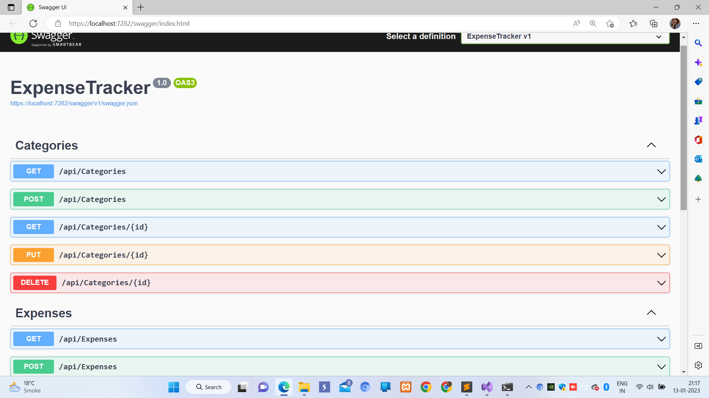
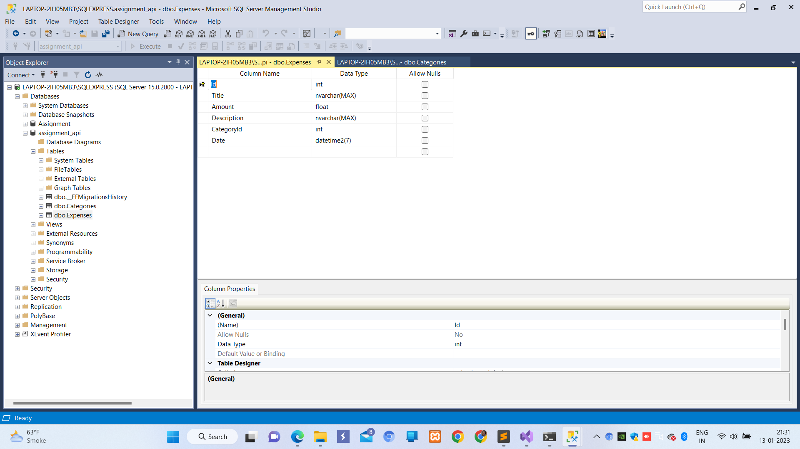
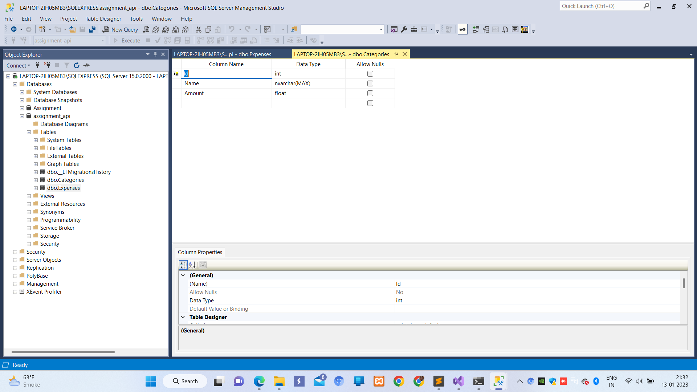
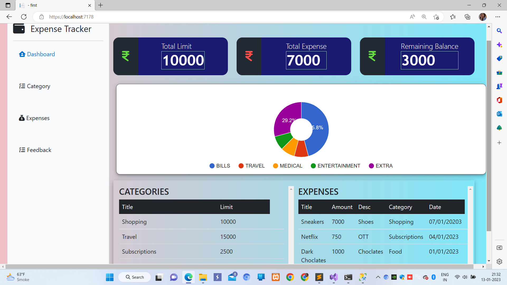

# Welcome to Expense Tracker!

Hello! I'm your guide to expense tracker project. read me to run the project.

# Prerequisites

- Visual Studio (2022)
- Sql Server Management Studio 
- .NET Framework
- .NET Core 
-  NUGet packages
	- ASP.NET Core entity framework
	- ASP.NET Core SQL Server
	- ASP.NET Core Tools
	- ASP.NET Core Design
	- ASP.NET Core Cors
	- Swagger
## Steps for installation
1. open visual studio
2. install the prerequisites
3. load the project
4. change server name in connection string (present in appsettings.json file)
5. add migration in your pacakage manager
6. use command update-database in your package manager
7. run the program
8. let the swagger run
9. open the index.html from the directory

** NOTE :  Use the frontend folder for UI content **

## Process 

1. Create Category (Add , edit , delete) --> Set Category Name and Limit.
2. Add Expense for the respective categories --> Add expense details such as Name,Type,Date.

## Screenshots

